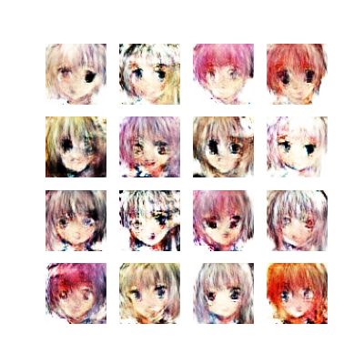

# animator

This repository is for generating anime images using LSGAN based architecture. It generates faces of anime chars for 64x64 dims.



### requirements
- tensorflow >= 2.0
- pillow
- matplotlib

### Preparing virtual env
If you dont have venv installed in your system you can do it by using
```
sudo apt install python3-venv
```
Now create virtual enviornment for your application
```
python -m venv env
```

Activating the venv
- Ubuntu/Linux
```
source env/bin/activate
```

- Windows
```
.\env\Scripts\activate
```

### Downloading the dataset
This dataset is openly available on kaggle which could be found [here](https://www.kaggle.com/splcher/animefacedataset)

### How to train model
```
python3 main.py
```

### How to Generate Images?
Image generation can be carried out using two different methods, which are as follows:

#### Downloading Checkpoints
The latest training checkpoints can be downloaded from [gdrive](https://drive.google.com/file/d/1MmIDPlkyktsTI2uHSnal_kvkgkbnqIYG/view?usp=sharing).
The files are in zip format. You need to unzip it in order to use it.

#### Using shell
```bash
python -i generate_images.py

image_generator = AnimeImageGenerator()
image_generator.generate_images()
```

#### In a python file
```python
from generate_images import AnimeImageGenerator

image_generator = AnimeImageGenerator()
image_generator.generate_images()
```
